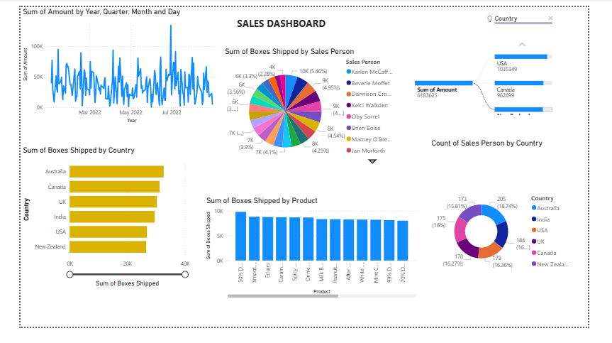

# 📊 Sales Dashboard (Power BI)

This repository contains my **first Power BI dashboard** built for analyzing sales performance across countries, products, and salespersons.

## 🚀 Overview

The **Sales Dashboard** provides insights into:

* **Sales Trends**: Daily/Monthly/Quarterly sales amount over time
* **Sales by Country**: Total boxes shipped across different countries
* **Sales by Salesperson**: Contribution of each salesperson to total shipments
* **Sales by Product**: Comparison of shipments for different products
* **Country-wise Sales Distribution**: Salesperson count and shipped boxes breakdown by region

## 📌 Key Visuals

* **Line Chart** → Sales amount trend by date
* **Bar Chart** → Boxes shipped by country & by product
* **Pie Chart** → Contribution of each salesperson
* **Donut Chart** → Count of salespersons by country

## 🛠 Tools Used

* **Power BI Desktop** – For dashboard design & visualization
* **Dataset** – Sales records with country, product, and salesperson details

## 📷 Dashboard Preview

✨ Feedback is welcome! This is my first Power BI dashboard, and I’m looking forward to improving it further.
